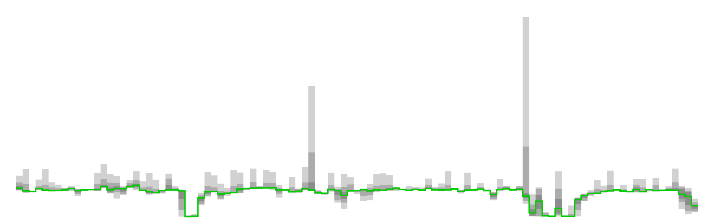

# D3 Smokechart

d3 plotting library to display the variance of a set of values
for a time interval as "smoky bands" surrounding the median value for that interval.

## Plotting Smokedata

The input data ("smokedata") is an array of arrays of numeric data.
Each row contains a set of data samples for a particular time period.
The resulting chart has grey areas that show the range of the samples
at certain thresholds above and below the median value.
Those band look like smoke, giving the chart its name.

The initial use case was to display 30-second samples of response times;
each vertical slice represents an hour of data.
Here is a sample of a smokechart:



## Experimenting with Smokecharts

The file `example/smoke.html` has sample data that can be used to experiment with the appearence of the smokecharts.
The easiest way to use it is to install [**browser-sync**](https://browsersync.io/) globally, then run the following commands.
Changes to the `smoke.html` file trigger a browser reload.

```
cd path-to-d3-smokechart/example
browser-sync start --server --files *.html
```
Then open your browser to [http://localhost:3000/smoke.html](http://localhost:3000/smoke.html) and begin editing.

## Functions 

smoke.chart() -

smoke.data() - 

smoke.adjustScaleRange() -

smoke.scaleX() -

smoke.scaleY() -

smoke.line() - 

smoke.smokeBands(numBands) - 

quantile() - 

calculateSmokeBands() -

smoke.countErrors() - 

## Data structures

smokeData - array of arrays containing original data.  

smokeBands - 


smoke options - 

smokeAreaConfig - 

flameAreaConfig - 

