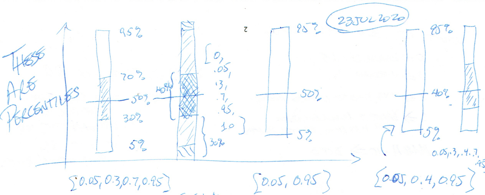

# d3.Smokechart Code Narrative

**d3.Smokechart** takes an array of SmokeData (each row is itself an array of numbers)
and plots them with the [D3 visualization package.](https:/d3js.org)
The original use case for a smokechart was to record and display network response times,
where each row of the array contains the measurements (samples) from an hour's time,
and the resulting chart displays the range of those samples during that hour.

The grey colored bands show how tightly clustered the readings are to the median value for the interval (shown in blue.)

*Note:* The image above envisioned specifying bands as increasing breakpoints.
Current code specifies bands as array of arrays whose items are
pairs of numbers, the "outside values" specified first.
viz, `[ [0, 1], [0.1, 0.9], [0.25, 0.75] ]`

Smoke Charts show percentiles.
Each vertical stripe contains one or more *smoke bands* that mark the *range* of
the sample values that are within the specified bands.
For example, a band of `[0.1, 0.9]` marks the minimum and maximum sample values
that are between the 10th percentile and the 90th percentile of the range.

**Missing Values:** The smokechart displays the data samples for each hour, no matter how many samples are present.
However, it is useful also to indicate the number of "missing" values
(where, for example, the application sent a ping but no response returned.)
This "packet loss" is an orthogonal indication of a network impairment,
separate from the measured response times.
The chart uses a red tint for the smoke bands: the intensity of the tint indicates the percentage
of dropped packets/missing values.

*(redundant)* In addition, the data samples may have "missing data" which could occur
when the application attempted a measurement, but no data returned.
(This happens regularly with ping tests - no response returns to the request because of a network outage.)
The SmokeData array represents these missing values as NaN.
The Smokechart adds color to the smoke for that hour (default - a red tint)
representing the percentage of missing data in that row.
A small percentage of missing values will be unnoticed; significant packet loss will show up strongly.

**Data & Props** 

* The SmokeData (raw samples)
* Percentiles - numeric bounds of the percentiles that mark edges of smoke bands
* Smoke Color (default: Black #000000, with varying transparency)
* Smoke Transparency array: transparency for each smoke band, default 0.18)
* Median Color (default: Blue-700 #1976D2 or Green-700 #388E3C)
* Error Color (default: Red-700 #D32F2F)
* X/Y Bounds for drawing the chart 
* Number of vertical stripes (0 = draw as many stripes as data rows, otherwise, push additional empty rows onto the beginning of SmokeData to get the desired number of stripes)
* *Note: Colors drawn from [The Color System](https://material.io/design/color/the-color-system.html#tools-for-picking-colors)*

**Error Processing:** The simplest way to handle programming errors (such as overlapping ranges, bad data, etc.)
would be to inject a text() element into the D3 SVG with that error message.
No exceptions are necessary, and the text should make it obvious what the author needs to fix.
For example: 

* "Cannot plot bands of [ [0,0.5], [0.25, 0.75] ]" (since they overlap)
* "Cannot plot bands of [ 0, 1, 2 ]" (since it's not a well-formed array of arrays.)
* "Cannot plot bands of [ [0, 1], 'text' ]" (C'mon...)

**Handling Peculiar Data Situations:** What if there are a few elements in a row?

* 0 rows ([ ] as smokeData) - "Error: No data provided."
* 1 row - should just work
* 0 elements in a row - blank stripe
* 1 element in a row - draw the median
* 2 elements in a row - draw the average, the darkest band at min/max
* 3-10 elements in a row - draw middle (median/average) value, the darkest band for min/max  
* all NaN - (1 or more NaN) Error Color drawn at zero
* N% NaN - tint the smoke with Error Color, tint the median, too
* 10%+ NaN - color median as Error Color, too

**To-Do/Sanity Checking:**

* Redraw the image at top of this document to match band ranges notation
* SmokeProps() to add props (none of the magic stuff)
* Yes. ~~Does [0.1, 0.9] actually indicate the 10th & 90th percentile samples?~~
* Yes. ~~Are the bands actually drawn correctly, or do they use some computed notion of
"where they oughta be..." (see d3.quantile(smokeData[2], 0.2) discussion...~~
* ~~Why can't the package handle a single row of `[ [1] ]`? Seems to require three rows(?)~~ Seems OK now.
* Remove all APIs that offer # bands, only offer ranges...
* Use differing opacities for bands (instead of just 0.18)
* Can X/Y Bounds default to the enclosing div?

## *Smokechart* Data Structures

* **SmokeData** - array of HourSamples - one row per hour
* **HourSamples** - array of numeric data (or NaN), not necessarily integers, representing samples "from an hour"
* **cleanData** - SmokeData that has been sorted with NaNs filtered out

The following two-element arrays specify different aspects of the Smokechart data.
Each of these arrays has the same number of elements. 

* **percentiles** specifies the percentiles that are the bounds for the smoke. [ [0,1], [.25,.75] ] draws two bands, one for min&max values, the second for the 25th through 75th percentiles.

* **smokeBounds** holds the sample values that represent the edges of the specified **percentiles** for each hour's row.
Elements don't have structure - just N values in a flat array.

* **smokeBands** holds the SVG \<path> information describing the smoke to be drawn for each row.
Like smokeBounds, the smokeBands are a flat array.
 

* 

## *Smokechart* Functions

**Smokechart constructor:** is called with an array of Smokedata and some options.
It returns a function that may be called to provide the data to D3.
Along the way, it prepares an array (with the same number of rows) suitable for a stacked array display in D3.

**quantile(HourSamples, q)** - determine the q'th sample of the array.

Each of these functions returns the class object, allowing them to be chained.

* **smoke(SmokeData, Opts?)** - This function can be called to return the chartable data array.

* **data(Smokedata)** - This function sets the class variable *cleanedData* to the input, with each row sorted.
It also removes NaN values.

-------
*not sure this is right from here down*

* **adjustScaleRange()** - This function adjusts the X/Y scale input ranges to fit the chart properly
* 

